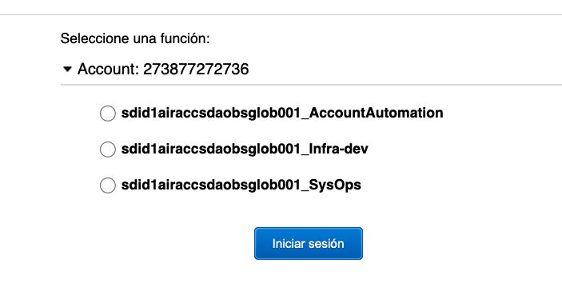
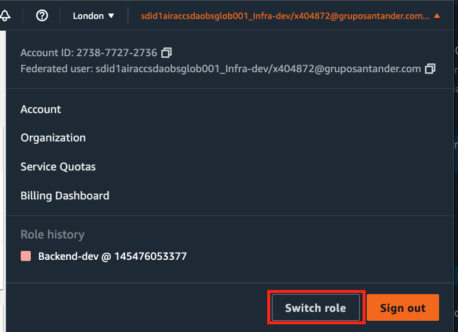
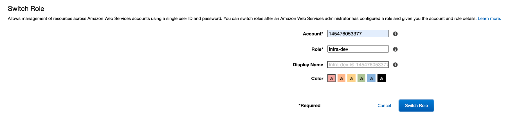

# Add DB to microservice API

## Login with AWS Web console.

 - Login using https://myapplications.microsoft.com/. You have to click the `Amazon_Web_Services_SDA` icon. In case you have several roles available, you will have to choose one of them to continue:
<br/><br/>
 \
 <br/><br/>
- Once you select the role and login into the web console, you'll still need to do a `Switch Role`. To do this, click into the `Switch Role` button from your user menu and fill in the required values:
<br/><br/>
 \
 <br/><br/>
 \
<br/><br/>
<br/><br/>

Note: Remember that you have to select this zone in the upper menu: Europe(Ireland) ---- eu-west-1

## Login with AWS CLI.

- In order to login using AWS CLI, the following needs to be done the first time:
  ```
  npm install -g aws-azure-login
  ```
  ```
  export AWS_PROFILE=sso (this profile shouldn't exist, or it will be overwritten)
  ```
  ```
  aws-azure-login --configure
  ````

  You'll need these values for the above command:
  ```
  Azure Tenant ID: 35595a02-4d6d-44ac-99e1-f9ab4cd872db
  Azure App ID URI: https://signin.aws.amazon.com/saml
  ```

  Create a new profile in the `~/.aws/config` file like this (replace with proper values):
  ```
  [profile sso-backend-dev]
  source_profile=sso
  region=eu-west-1
  role_arn=arn:aws:iam::145476053377:role/Backend-dev
  role_session_name=x404872@gruposantander.com
  ```

  From now on, you can login with the following command using your LDAP username/password:
  ```
  aws-azure-login --mode=gui
  ```
  Please note that it will ask you to establish a `session duration`. It must be set to 1 hour or the login process will fail.

  Once logged, export the new `AWS_PROFILE` that you've created in a previous step:
  ```
  export AWS_PROFILE=sso-backend-dev
  ```
  If the token expires, you can renew it this way (replace the `sso` value with your profile's name):
  ```
  aws-azure-login --profile=sso --no-prompt
  ```

## Connect to AWS environment

### Only first time
  Install [aws-cli](https://docs.aws.amazon.com/cli/latest/userguide/getting-started-install.html)

  First ...
  ```
  aws eks --region eu-west-1 update-kubeconfig --name potd1aireksemoneypmts001
  ```
  ... second
  ```
  ./scripts/aws-ssm-ec2-proxy-command.sh
  ```

### Every time yo need to connect to AWS
To connect:
  ```
  ./scripts/wfh_aws
  ```

### Every time yo need to test your App
To port forwarding your app and your database
  ```
  ./scripts/connect_app <db_boolean> <pod_name> [<branch_name>]
  ```
  After that you can connecto to your DB with ```localhost<microserviceName>-db:5433``` and to your app with ```http://localhost:8080/<microserviceName>```

## Database configuration on Infrastructure project
  * [Infrastructure project](https://gitlab.com/pagofx/emoney/infrastructure):
    - Terraform values -> main/dev/terraform.tfvars
      ```
      <microservice_name> = {
          sql_db_enable = true
          sql_db_create = true
          prefix        = "<microservice_name>"
          schema        = ["<microservice_db_schema_name>"]
          users         = []
          hostname      = "ms"
          zone          = "openapi"
          uris          = ["/<microservice_name>"]
        }
      ```
    - DB Passwords -> main/dev/secrets_passwords.enc.json
      ```
        "db_<microservice_name>_user_password": "<generated_encrypted_password>",
        "db_<microservice_name>_read_user_password": "<generated_encrypted_password>",
        "db_<microservice_name>_editor_user_password": "<generated_encrypted_password>",
      ```

## Database configuration on microservice project
  * gitlab-ci.yml:
    ```
      variables:
        POD_NAME: '<microservice_name>'
        POD_TYPE: 'deployment'
        DB_PREFIX: '<microservice_name>'
        DB_DATABASE: '<microservice_name>-db'
        RUN_FEAT: 'true'
        REGSECRET: 'regsecret-github-microservices'
        SHARED_TOKEN_REGISTRY: $SHARED_TOKEN_REGISTRY
        URI: '<microservice_name>'

      include:
        - template: Security/SAST.gitlab-ci.yml
        - project: pagofx/ci/backend-pipeline
          ref: develop-aws
          file:
            # Shared definitions
            - gitlab-ci/.gitlab-ci-shared.yml
            # Release
            - gitlab-ci/release-github.yml
            # Stage dbcreation
            - gitlab-ci/db-snapshot-downloader.yml
            - gitlab-ci/db-snapshot-downloader-test.yml
            # Stage migrate
            - gitlab-ci/db.yml
            - gitlab-ci/db-test.yml
            - gitlab-ci/db-pg-diff.yml
            # Stage test-lint-build
            # - gitlab-ci/pre-merge.yml
            # Stage build-deploy
            - gitlab-ci/db-snapshot-uploader.yml
            # Stage build deploy
            - gitlab-ci/build-deploy.yml
            # Cleanup
            - gitlab-ci/cleanup.yml
            # SAST
            - gitlab-ci/sast.yml
            # Config maps
            - gitlab-ci/config-maps.yml
      # Stage sonar
      # - local: gitlab-ci/sonarcloud.yml
      #  - local: gitlab-ci/pre-merge.yml
    ```
  * package.json:
    ```
      "scripts": {
        ...
        "db:local:create": "./scripts/create-local-db $npm_package_config_container_name",
        "db:local:start": "docker start $npm_package_config_container_name",
        "db:local:stop": "docker stop $npm_package_config_container_name",
        "db:local:up": "db-migrate up --migrations-dir './db/migrations' --config './db/database.json' --env 'dev'",
        "db:local:down": "db-migrate down --migrations-dir './db/migrations' --config './db/database.json' --env 'dev'",
        "db:migration:create": "db-migrate create $migration_name --sql-file --migrations-dir './db/migrations' --config './db/database.json' --env 'dev'"
      }
      ...
        "dependencies": {
      ...
      "@pagonxt/em-accs-common-lib": "latest",
      ...
      }
    ```
  * infrastructure/**/*-config-map.properties:
    ```
      PGDATABASE=<microservice_name>-db
      DEPLOYMENT_ENVIRONMENT=<envionmnt (dev | prod)>
      EXPOSE_API_DOCS=true
      APP_SHORT_NAME=<microservice_short_name>
    ```
  * infrastructure/**/deployment.yml:
    ```
      apiVersion: apps/v1
      kind: Deployment
      metadata:
        name: <APP_NAME>
        labels:
          branch: <BRANCH_NAME>
          repo: <REPO>
      spec:
        selector:
          matchLabels:
            app: <APP_NAME>
        replicas: 1
        template:
          metadata:
            labels:
              env: <ENV>
              app: <APP_NAME>
          spec:
            imagePullSecrets:
              - name: <REGSECRET>
            containers:
              - name: <APP_NAME>
                image: <IMAGE>
                ports:
                  - containerPort: 3000
                    name: http-alt
                envFrom:
                  - configMapRef:
                      name: db-config-map
                  - configMapRef:
                      name: common-config-map
                  - configMapRef:
                      name: onetrade-beneficiary-mgmt-config-map
                env:
                  - name: PGUSER
                    valueFrom:
                      secretKeyRef:
                        name: <DB_DATABASE>
                        key: user
                  - name: PGPASSWORD
                    valueFrom:
                      secretKeyRef:
                        name: <DB_DATABASE>
                        key: password
                  - name: MICROSERVICE_NAME
                    value: <REPO>
    ```
  * src/app/index.ts:
    ```
      ...
      import { defaultClient } from '@pagonxt/em-accs-common-lib/lib/db';
      ...
      defaultClient.init();
      /**
      * Server Activation
      */
      app.listen(PORT, () => {
      ...
    ```
  * db/**:
    - Copy the hole folder to the microservice folder
    - Remove migrations folder content
    - run ```npm install```
    - run ```npm run migration```
    - Change db/downloader-entrypoint (with '_' instead of '-' in the microservice_name)):
      ```
      ...
      CREATE USER <microservice_name>_read_user;
      CREATE USER <microservice_name>_editor_user;
      ...
      ```
  * Change (if exists) chart/Chart.yaml:
    ```
    ...
    name: <microservice_name>
    ...
    ```
  * Change (if exists) chart/values.yaml:
    ```
    ...
       repository: <registry>/ccoe-alm/<microservice_name>
       pullPolicy: Always
       tag: latest>

     imagePullSecrets: []
       # Uncomment and remove [] to specify custom secret
       # DEV default secret 'github'; INT default secret 'acr'
       # - name: <namePullSecret>>

     service:
       type: ClusterIP
       portName: http
       port: 80
       targetPort: 80>

     ingress:
       enabled: true
       hosts:
         - host: <microservice_name>.monitor.pagonxt.dev.corp
           paths:
             - path: "/"
               pathType: Prefix
       tls:
         - hosts:
             - <microservice_name>.monitor.pagonxt.dev.corp
    ...
    ```
  * src/db/*.ts:
    > Code needs to be changed to launch the specific microservice CRUD on database